# zq, an example for using ZeroMQ

zq is a sample app using zmq's multipart messages to sent different types to the same endpoint.
The concept is simple, put the type info in the first message part, and the value in the second.
Besides trivial copyable types, there is a sample on how to send a std::string, and there is a sample on how to send Protobuf messages.
All these types can be send to the same endpoint and accordantly restored there.
This means also, subscribers do subscribe on types.

The code in the project shall be used as inspiration what can be done and how to work type driven, if wanted, via ZeroMQ.
It is not meant to be a library. See the test for usage examples.

Building the project and the tests requires VCPKG and CMake.
If vcpkg is not installed in `~/vcpkg`, then set the environment variable VCPKG_ROOT to the correct path.
You can run the code on Linux Windows and Mac if you have a compiler that is C++20 capable.

All the code is MPL 2.0 licensed.

## Building the project

The project supports [CMake presets](https://cmake.org/cmake/help/latest/manual/cmake-presets.7.html).
You may explore the presets available on your system by executing

```bash
cmake --list-presets
```

Once you have decided which preset you want to use, configure and build like so:

```bash
cmake --preset=<name>
cmake --build --preset=<name>
```

## Running tests

After the project has been built, you are ready to run the tests:

```bash
ctest --preset=<name>
```


## GitDiagram

Generated via: https://gitdiagram.com/a4z/zq

```mermaid
graph TB
    subgraph "Client Applications"
        Client["Client Applications"]:::client
        click Client "https://github.com/a4z/zq/blob/main/src/example_c_client.cpp"
        Server["Server Applications"]:::client
        click Server "https://github.com/a4z/zq/blob/main/src/example_c_server.cpp"
    end

    subgraph "ZQ Interface Layer"
        ZQInterface["ZQ Main Interface"]:::interface
        click ZQInterface "https://github.com/a4z/zq/blob/main/include/zq/zq.hpp"
    end

    subgraph "Type System Layer"
        BasicMsg["Basic Message Handler"]:::type
        click BasicMsg "https://github.com/a4z/zq/blob/main/include/zq/message.hpp"
        ProtoMsg["Protobuf Message Handler"]:::type
        click ProtoMsg "https://github.com/a4z/zq/blob/main/include/zq/message_proto.hpp"
        SocketFlags["Socket Flags"]:::type
        click SocketFlags "https://github.com/a4z/zq/blob/main/include/zq/zflags.hpp"
    end

    subgraph "Core Components"
        Context["Context Management"]:::core
        click Context "https://github.com/a4z/zq/blob/main/include/zq/context.hpp"
        Socket["Socket Handling"]:::core
        click Socket "https://github.com/a4z/zq/blob/main/include/zq/socket.hpp"
        Error["Error Handling"]:::core
        click Error "https://github.com/a4z/zq/blob/main/include/zq/error.hpp"
        Message["Message Processing"]:::core
        click Message "https://github.com/a4z/zq/blob/main/include/zq/message.hpp"
        Config["Configuration"]:::core
        click Config "https://github.com/a4z/zq/blob/main/include/zq/config.hpp"
    end

    subgraph "Testing Framework"
        BaseTests["Base Tests"]:::test
        click BaseTests "https://github.com/a4z/zq/tree/main/tests/base"
        CommuTests["Communication Tests"]:::test
        click CommuTests "https://github.com/a4z/zq/tree/main/tests/commu"
        ContextTests["Context Tests"]:::test
        click ContextTests "https://github.com/a4z/zq/tree/main/tests/ctx0"
        ProtoTests["Protocol Buffer Tests"]:::test
        click ProtoTests "https://github.com/a4z/zq/tree/main/tests/proto"
        ExtTests["Extension Tests"]:::test
        click ExtTests "https://github.com/a4z/zq/tree/main/tests/xtend"
        XtraTests["Extra Tests"]:::test
        click XtraTests "https://github.com/a4z/zq/tree/main/tests/xtra"
    end

    subgraph "Communication Patterns"
        PubSub["PUB/SUB Pattern"]:::pattern
        click PubSub "https://github.com/a4z/zq/blob/main/tests/commu/pub_sub_test.cpp"
        BasicComm["Basic Communication"]:::pattern
        click BasicComm "https://github.com/a4z/zq/blob/main/tests/commu/hello_test.cpp"
        ProtoComm["Protobuf Communication"]:::pattern
        click ProtoComm "https://github.com/a4z/zq/blob/main/tests/commu/hello_proto_test.cpp"
        TypedMsg["Typed Messages"]:::pattern
        click TypedMsg "https://github.com/a4z/zq/blob/main/tests/commu/typedmessage_test.cpp"
    end

    subgraph "External Dependencies"
        ZMQ["ZeroMQ Library"]:::external
        Protobuf["Protocol Buffers"]:::external
        CPP["Standard C++ Library"]:::external
    end

    subgraph "Build System"
        CMake["CMake Configuration"]:::build
        click CMake "https://github.com/a4z/zq/blob/main/CMakeLists.txt"
        VCPKG["VCPKG Dependencies"]:::build
        click VCPKG "https://github.com/a4z/zq/blob/main/vcpkg.json"
    end

    %% Relationships
    Client & Server --> ZQInterface
    ZQInterface --> BasicMsg & ProtoMsg & SocketFlags
    BasicMsg & ProtoMsg --> Message
    Message --> Context & Socket
    Socket --> Error
    Context --> Config
    ProtoMsg --> Protobuf
    Socket --> ZMQ
    CommuTests --> PubSub & BasicComm & ProtoComm & TypedMsg

    %% Styles
    classDef core fill:#2196F3,stroke:#1565C0,color:white
    classDef type fill:#4CAF50,stroke:#388E3C,color:white
    classDef external fill:#FFC107,stroke:#FFA000,color:black
    classDef test fill:#9E9E9E,stroke:#616161,color:white
    classDef pattern fill:#673AB7,stroke:#512DA8,color:white
    classDef interface fill:#00BCD4,stroke:#0097A7,color:white
    classDef client fill:#FF5722,stroke:#E64A19,color:white
    classDef build fill:#795548,stroke:#5D4037,color:white

```



😊 
